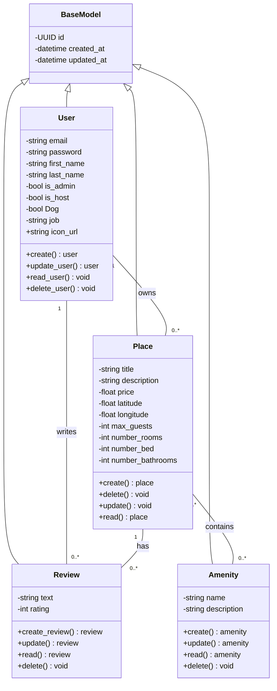

# HBnB Evolution: The Definitive AirBnB Clone API


**HBnB Evolution** is a robust, production-grade RESTful API designed to mirror the core functionality of the AirBnB platform. Built with Python and Flask-RESTX, this project emphasizes clean code principles, strict architectural separation, and scalability.

---

## 🏗️ Architecture

The project implements a **Multilayered Architecture** to ensure a high degree of maintainability and decoupling. By utilizing the **Facade Pattern**, we provide a unified interface for the API layer to communicate with the complex business logic.

### The Four Layers:

1. **Presentation Layer (API):** Built with Flask-RESTX, it handles HTTP requests, input validation through Data Transfer Objects (DTOs), and returns structured JSON responses.

2. **Business Logic Layer (Services/Models):** The "brain" of the application. It defines core entities (User, Place, Review, Amenity) and enforces business rules.

3. **Persistence Layer (Repository):** Currently an in-memory storage system. It is abstracted through a Repository Pattern, allowing for a seamless transition to a relational database in the future.

4. **Facade Layer:** Acts as the intermediary, orchestrating data flow between the API and the Service layers to minimize dependencies.

---

## 📊 Class Diagram



---

## 🚀 Installation

Follow these steps to set up the development environment on your local machine:

### Clone the Repository

```bash
git clone https://github.com/your-username/hbnb-evolution.git
cd hbnb-evolution
```

### Create a Virtual Environment

```bash
python3 -m venv venv
source venv/bin/activate  # On Windows: venv\Scripts\activate
```

### Install Dependencies

```bash
pip install -r requirements.txt
```

### Run the Application

```bash
python run.py
```

The API will be accessible at:

```
http://127.0.0.1:5000
```

with interactive Swagger documentation.

---

## 🛣️ API Endpoints

### 👤 User Management

| Method | Endpoint | Description |
|--------|----------|------------|
| POST | /api/v1/users/ | Register a new user |
| GET | /api/v1/users/ | Retrieve all users |
| GET | /api/v1/users/<id> | Get user details by ID |
| PUT | /api/v1/users/<id> | Update user profile |

---

### 🏡 Amenity Management

| Method | Endpoint | Description |
|--------|----------|------------|
| POST | /api/v1/amenities/ | Create a new amenity |
| GET | /api/v1/amenities/ | List all available amenities |
| GET | /api/v1/amenities/<id> | Get amenity details |

---

### ⭐ Review System

| Method | Endpoint | Description |
|--------|----------|------------|
| POST | /api/v1/reviews/ | Submit a review for a place |
| GET | /api/v1/places/<id>/reviews | Get all reviews for a specific place |
| DELETE | /api/v1/reviews/<id> | Remove a review |

---

## 📋 Request / Response Examples

### Creating a Review

**POST** `/api/v1/reviews/`

```json
{
  "text": "Amazing stay! The view was breathtaking and the host was very welcoming.",
  "rating": 5,
  "user_id": "3fa85f64-5717-4562-b3fc-2c963f66afa6",
  "place_id": "d7b1a2c3-4e5f-6g7h-8i9j-0k1l2m3n4o5p"
}
```

---

### Retrieving Place Details

**GET** `/api/v1/places/<id>`

```json
{
  "id": "d7b1a2c3-4e5f-6g7h-8i9j-0k1l2m3n4o5p",
  "title": "Cozy Beachfront Cottage",
  "description": "A quiet place by the sea, perfect for weekend getaways.",
  "price": 120.50,
  "latitude": 34.0194,
  "longitude": -118.4912,
  "max_guests": 4,
  "number_rooms": 2,
  "amenities": ["WiFi", "Kitchen", "Free Parking"],
  "owner_id": "3fa85f64-5717-4562-b3fc-2c963f66afa6"
}
```

---

## 🛠️ Future Improvements

- **Authentication:** Implementation of JWT (JSON Web Tokens) for secure access control.
- **Database Migration:** Swapping the in-memory repository with PostgreSQL using SQLAlchemy.
- **Testing:** Expanding the test suite with Pytest to achieve >90% code coverage.
- **Dockerization:** Containerizing the application for streamlined deployment.

---

## ✍️ Author & License

Developed by **[AMBLARD Alison]** – 

Distributed under the MIT License. See `LICENSE` for more information.
